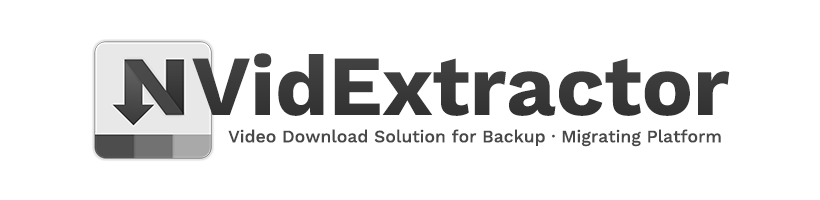

# NVidExtractor

[최신 버전 다운로드 (v1.2)](https://github.com/pdjdev/NVidExtractor/releases/download/v1.2/NVidExtractor_1200.zip)

## 소개
NVidExtractor는 네이버 블로그에 업로드된 비디오를 백업하거나 플랫폼을 이주하기 위해 편리하게 백업할 수 있는 유틸리티입니다.

## 비교표
||Naver|NaverTV|kakaoTV|PandoraTV*|
|-|-|-|-|-|
|비디오 다운로드|O|X|O|O|
|썸네일 확인|O|X|O|O|
|최대 화질|1080p|X|1080p|1080p|
|동시 다운로드|O|X|O|X|
|자막(srt) 다운로드|O|X|X|X|
|용량 미리 확인|O|X|X|X|
|자동 비디오 추가|O|X|X|X|

##### *PandoraTV는 현재 테스트 중이므로 불안정할 수 있습니다

## 자주 묻는 질문

#### Q. 어떤 비디오가 다운로드되나요?
A. 네이버 블로그에 업로드 된 비디오, 그리고 카카오 TV에 올라온 단일 비디오의 공유 링크를 입력하시면 다운로드 받으실 수 있습니다.

#### Q. 다운로드를 받는 도중 진행바가 빨간색으로 변하면서 다운로드 진행이 안됩니다. 왜 이런거죠? 어떻게 해야 하나요?
A. 프로그램이 비디오를 요청하고 받는 도중에 링크 만료, 인터넷 연결 문제 등으로 인해 문제가 발생하면 자동으로 다운로드를 중단하게 됩니다. 우선 대략 10~30초 정도 기다린 뒤 다운로드 패널의 오른쪽에 있는 재개 버튼(▶)을 눌러 보시고, 여전히 문제가 발생한다면 해당 다운로드를 선택한 뒤(배경이 옅은 파랑으로 바뀝니다) '강제 초기화' 버튼을 눌러 재시작해보시기 바랍니다.

#### Q. 비디오를 받고 재생해보니 끊겨요. 뒷부분이 재생이 잘 안됩니다.
A. 프로그램이 비디오를 다운 받으면서 연결 문제 등으로 인해 완료되었다고 표시되었음에도 불구하고 제대로 받지 못했을 수도 있습니다. 번거로우시겠지만 해당 파일은 지우고 다시 받아보시고, 현상이 지속된다면 다른 화질로 다운로드를 시도해 보시기 바랍니다.

#### Q. 네이버 TV는 다운로드가 안되나요?
A. 네이버 TV는 대부분이 개인 비디오가 아닌 저작권에 민감한 컨텐츠가 대부분이라서 백업 작업에 필요없다고 생각해 다운로드 지원을 하지 않고 있습니다. 죄송합니다 ㅠ

#### Q. 자꾸 다운로드가 끊겨요. '접근 거부됨' 과 같은 오류가 떠요.
A. 너무 많은 비디오를 한번에 받으실 경우 일시적으로 접속이 거부될 수 있습니다. 동시 다운 개수를 줄여서 잠시 후에 다시 시도해 보세요.

#### Q. 아예 다운로드가 되지를 않습니다. 네이버 블로그 불러오기 기능이 먹통입니다.
A. 프로그램이 영상을 다운로드 받는 방식은 비공식적인 방식이기 때문에 네이버가 서비스의 내부 구조를 바꾸는 등의 변수가 생긴다면 다운로드가 먹통이 될 수 있습니다. 프로그램의 기능 중 일부가 제대로 작동하지 않는 경우, 우선 최신 버전이 있는지 확인해 보시고, (https://sites.google.com/view/nvext) 여전히 작동이 되질 않는다면 제작자 github의 프로필에 있는 메일로 연락을 주시거나 프로그램 웹페이지의 피드백 양식을 보내주시면 최대한 빠르게 대응할 수 있도록 하겠습니다.

## 참고/유의사항
- 본 프로그램은 비공식적인 방식으로 추출하기 때문에 언제든지 정상적으로 작동이 안될 수 있으므로 양해 바랍니다.
- 본 프로그램을 악용하지 마십시오 - 이에 대한 피해는 제작자가 책임 져 드릴 수 없습니다.
- 본 프로그램은 재배포가 가능합니다. 단, 임의로 변경하여 재배포하실 수는 없습니다.
- 본 프로그램을 통해 받는 자막은 .srt 형식이나 실질적으로는 .vtt 형식입니다. 그렇기 때문에 만약 자막을 받았을 때 플레이어가 정상적으로 표시를 못할 경우 확장자를 vtt로 고쳐 다시 시도해 보시기 바랍니다.
